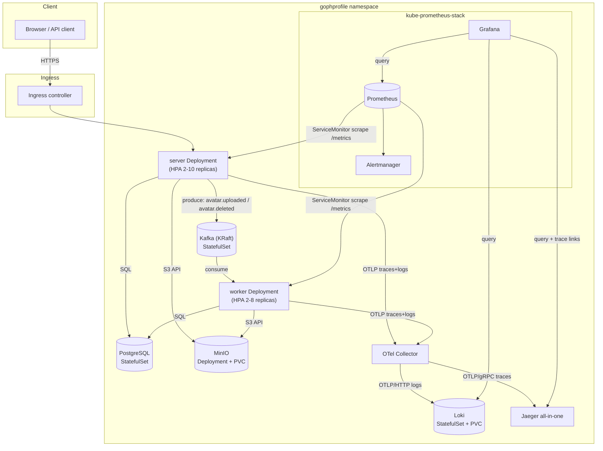

# Architecture

GophProfile is a two-process Go application (`server`, `worker`) sharing one
codebase, backed by PostgreSQL (metadata), MinIO/S3 (image bytes) and Kafka
(async processing/deletion). This document describes the Kubernetes topology
this Helm chart creates - see the repository root [README.md](../../README.md)
for the application-level design.

## Runtime topology

## Request flow: avatar upload

1. Client `POST /api/v1/avatars` (multipart) hits the Ingress, load-balanced
   across `server` replicas by the Service.
2. `server` validates the file (magic bytes, size, 20MP cap), stores the
   original in MinIO, writes the `avatars` row plus an outbox row in
   PostgreSQL in one transaction, and returns `202`-style `status: processing`.
3. An outbox publisher (inside `server`) emits `avatar.uploaded` to Kafka.
4. `worker` consumes `avatar.uploaded`, downloads the original from MinIO,
   generates 100x100/300x300 thumbnails, uploads them, and updates the row's
   `processing_status`.
5. Deletes follow the same outbox pattern via `avatar.deleted`, letting the
   worker remove S3 objects asynchronously after the row is soft-deleted.

## Why these Kubernetes primitives

| Concern | Primitive | Why |
| --- | --- | --- |
| Rolling deploys without downtime | `Deployment` (`maxUnavailable: 0`) + readiness probe | Old pod only leaves rotation once a replacement is Ready |
| Load spikes on upload | `HorizontalPodAutoscaler` (CPU+memory) | Server/worker scale independently since upload traffic and thumbnail CPU load differ |
| Voluntary disruption safety (node drains) | `PodDisruptionBudget` | Keeps `minAvailable: 1` during upgrades/maintenance |
| In-flight request draining | `preStop` sleep + `terminationGracePeriodSeconds` + `srv.Shutdown(ctx)` | Removes the pod from Endpoints before SIGTERM reaches the Go process |
| Traffic isolation | `NetworkPolicy` per component | Only the Ingress controller and Prometheus can reach `server`; only `server`/`worker` can reach Postgres/MinIO/Kafka |
| Least privilege | non-root `securityContext`, dropped capabilities, `readOnlyRootFilesystem` | Matches the Dockerfile's non-root `app` user |
| Metrics discovery | `ServiceMonitor` (Prometheus Operator CRD) | No manual `prometheus.yml` scrape config to maintain |
| Alerting | `PrometheusRule` (ported from `docker/alerts.yml`) | Same alert thresholds as docker-compose, evaluated by Prometheus Operator |
| Dashboards | Grafana sidecar-discovered `ConfigMap`s (ported from `docker/grafana-*.json`) | No manual Grafana provisioning step |

## Deliberate scope decisions

* **PostgreSQL, MinIO and Kafka are templated directly in this chart**
  (single-replica `StatefulSet`/`Deployment`, matching docker-compose's own
  non-HA topology) instead of pulled from the Bitnami chart repository, which
  no longer serves versioned chart releases over its classic index. Each can
  be pointed at a managed service instead by setting `<component>.enabled: false`
  and updating `values.yaml`'s connection settings.
* **kube-prometheus-stack is the one external chart dependency**, because
  `ServiceMonitor`/`PrometheusRule` are CRDs owned by the Prometheus
  Operator - there is no faithful way to "hand-roll" that controller.
